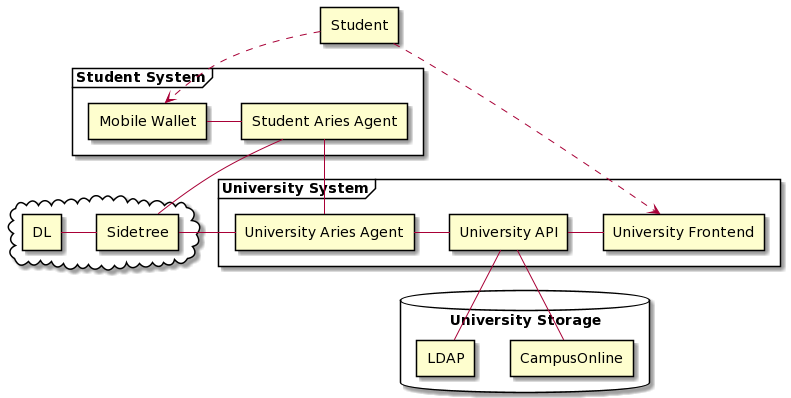

# KRAKEN Education Pilot - Demo Deployment (Docker)

Deployment of all server components needed to operate the demonstrator of an university credential exporter.

Part of the [**H2020 Project KRAKEN**](https://krakenh2020.eu/) and the [**Verifiable Credentials for Student Mobility**](https://api.ltb.io/show/BLUOR) project funded by TU Graz as a technologically enhanced administration (TEA) marketplace project.


## Startup

* to be able to start all containers, you need access to all required images (see below)
* don't forget to `docker login` without your GitHub credentials

```bash
./generate_demo_keys.sh
./docker-setup.sh

docker-compose up --force-recreate
```


## Docker Images

* [Connector (Frontend)](https://github.com/krakenh2020/EduPilotFrontend) [](https://github.com/krakenh2020/EduPilotPrototype1/actions/workflows/test-and-deploy.yml)
    - [kraken-edu_connector](https://github.com/krakenh2020/EduPilotFrontend/packages/629143)
* [API Platform (Backend)](https://github.com/krakenh2020/EduPilotBackend) [](https://github.com/krakenh2020/EduPilotBackend/actions/workflows/docker.yml)
    - [kraken-edu_php](https://github.com/krakenh2020/EduPilotBackend/packages/629100)
    - [kraken-edu_frontend](https://github.com/krakenh2020/EduPilotBackend/packages/629067)
* [Hyperledger Aries Agent](https://github.com/hyperledger/aries-framework-go)
    - [agent-rest](https://github.com/krakenh2020/EduPilotFrontend/packages/666143)
    - [sample-webhook](https://github.com/krakenh2020/EduPilotFrontend/packages/666127) 
* Sidetree: *TODO*


## Exposed Services

* University connector: http://localhost:8001
* University API: http://localhost:8000/
* University Aries Agent: (with TLS)
    - API: https://localhost:8082/
    - Inbound: https://localhost:8081/
    - Webhook: http://localhost:8083/
* Student Aries Agent: (no TLS)
    - API: http://localhost:8092/
    - Inbound: http://localhost:8091/
    - Webhook: http://localhost:8093/


### To test [mobile wallet](https://scm.atosresearch.eu/ari/kraken/ssi-ledgeruself-mobile) of student:

(use settings UI, or adapt `urlServer` in `src/main/java/eu/atos/ledgerUself/LedgerUSelf.kt`)

* Agent: `http://10.0.2.2:8092`
* Agent WS: `ws://10.0.2.2:8092/ws`


## (Simple) Architecture Overview


